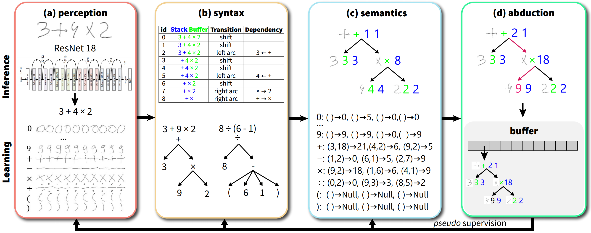

# A HINT from Arithmetic: On Systematic Generalization of Perception, Syntax, and Semantics

<div align="center">
  
</div>

## Prerequisites
* Ubuntu 20.04
* Python 3.6
* NVIDIA TITAN Xp
* PyTorch 1.7.0

## Getting started
1. Download the [HINT](https://drive.google.com/file/d/1vYADnDuWuW2V5kixvGAGIo_Vh6DyCJrD/view?usp=sharing) dataset and Unzip it to the `data/` folder:
```
cd data
tar -xvf hint.tar.xz
```

2. Download the pre-trained [ResNet-18](https://drive.google.com/file/d/1vDB88m50BMtcnyA8LOD7Uem2Q05nlg9q/view?usp=sharing) to the `data/perception-pretrain/` folder:


3. Download the [DreamCoder](https://drive.google.com/file/d/1HUi69T1LkrH7baxgXzbgE24bvXKgdIJt/view?usp=sharing) and unzip it to the `semantics/` folder.

4. Create an environment and install all packages from `requirements.txt`:
```
conda create -y -n ans python=3.6
source activate ans
pip install -r requirements.txt
```

## Train a single model
Train the proposed ANS model by running following
```
python train.py --curriculum
```

## Experiments
Training logs for all models are in the <a href = "/experiments">experiments</a> folder and run the following scripts to reproduce the results:
```
./run_0.sh
./run_1.sh
./run_2.sh
./run_fs.sh
```
These scripts will train different model variants and save the training logs into the `outputs` directory.

## Visualization
1. Download the trained [model](https://drive.google.com/file/d/1B_4R--hfdjtmmlEGKrC4ZW5PrzT-fOp4/view?usp=sharing) to the foler `experiments/`.
2. Run `visualize.ipynb` to visualize the model predictions.

